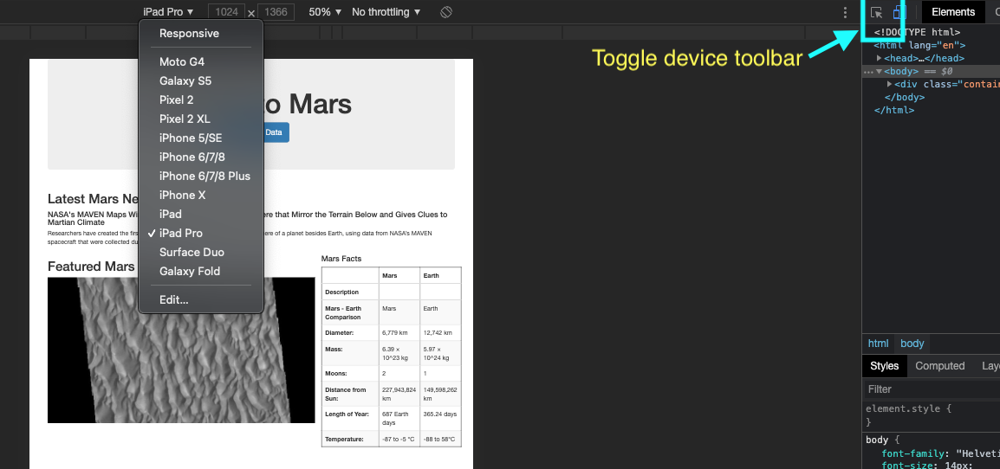
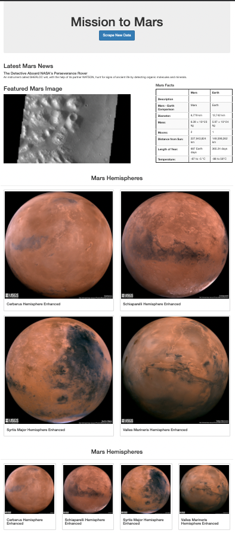

# Mission-to-Mars
## Overview:
Build an app to scrape four different Websites for data pertaining to the "Mission to Mars", and then create an HTML/CSS page to display findings using Flask and bootstrap. Also, did coding using python and Visual Basic Studio.

## Purpose and tools used for the project:
This project scrapes data from various websites to create an new webpagen named "Mission to Mars" that highlights facts about the planet Mars with Latest Mars, News, Mars facts, Featured Image and full Mars Hemispheres image. In order to complete this task, 
- I used splinter and beautiful soup libraries to scrape the relevant data. 
- From there, I transformed the data to a Mongo Database 
- Before uploading the data to my webpage using flask. 
- Lastly, I used bootstrap to cleanup my webpage to make it presentable.

## Results:
### Deliverable 1:
- Scrape Full-Resolution Mars Hemisphere Images and Titles

### Deliverable 2:
- Update the Web App with Mars Hemisphere Images and Titles

### Deliverable 3:
- Add two additional Bootstrap 3 Components to style the webpage and mobile-responsive

  - ### Toggle Device toolbar
  

  - ### Additional Bootstrap 3 components

## Summary:
- In this project, a web browser is automated to visit different NASA/gov websites to extract data about the "Mission to Mars". Scraped data was stored in a NoSQL database, and then rendered in a web application created with Flask. Latest Mars News, Featured Mars Image, Mars Facts and the images of four Mars Hemispheres have also been included in the web page in just a click on Scrape new Data button.

